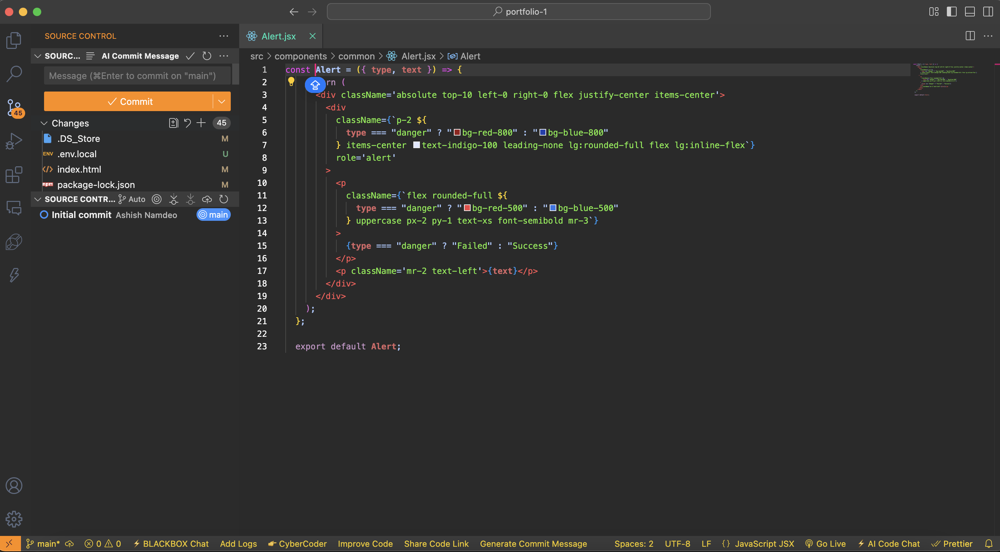

# Raipur Radiance - VS Code Theme

Raipur Radiance is a visually appealing VS Code theme inspired by the vibrant hues of Raipur. This theme features a warm and radiant orange color palette, providing a soothing yet energetic coding experience.

## Features
- **Relaxing Foreground & Background**: Carefully chosen colors to reduce eye strain.
- **Warm Orange Accents**: Enhancing readability and focus.
- **Optimized for Clarity**: Ensuring code is easy to read and distinguish.

## Installation

### From VS Code Marketplace (Coming Soon)
1. Open **Extensions** (`Ctrl+Shift+X` or `Cmd+Shift+X` on Mac).
2. Search for **Raipur Radiance**.
3. Click **Install** and activate the theme.

### Manual Installation
1. Clone this repository:
   ```sh
   git clone https://github.com/AshishNamdeo14/raipur-radiance
   ```
2. Open VS Code and navigate to `Extensions`.
3. Click `Install from VSIX` and select the downloaded `.vsix` file.

## Activating the Theme
1. Open Command Palette (`Ctrl+Shift+P` or `Cmd+Shift+P` on Mac).
2. Search for `Preferences: Color Theme`.
3. Select **Raipur Radiance** from the list.

## Screenshots


## Contributing
Feel free to contribute by reporting issues, suggesting improvements, or submitting pull requests.

## License
This project is licensed under the [MIT License](LICENSE).

---
### Enjoy a radiant and refreshing coding experience with Raipur Radiance! 🚀
